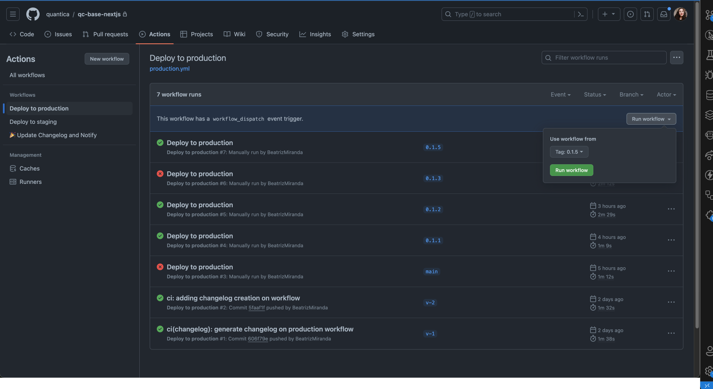

This is a React.js template for Quantica's projects

## Getting Started

First, run the development server:

```bash
yarn start
```

Open [http://localhost:3000](http://localhost:3000) with your browser to see the result.

## Release
To be able to create a new release and push changes to production, you need to follow this steps: 

- Go to Actions
- Click on `Deploy to Production`
- Click on `Run workflow`
- Select the tag you want to push to production
- And finally, click on `Run workflow`
- (I am needing to reload the actions page to be able to see the new workflow running)

